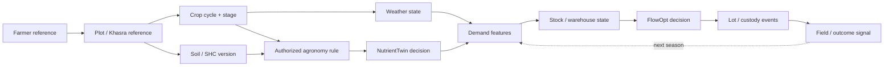

# RAJ-URVARA AI
## Rajasthan FarmGraph Nutrient & Fertilizer Digital Twin

**AI/ML-Driven Smart Fertilizer Formulation & Distribution Framework — Rajasthan Innovation Challenge 2026**

> **Right nutrient · right plot · right time · right bag.**

RAJ-URVARA AI is Syntheon Tech Private Limited's governed fertilizer intelligence and trust layer for Rajasthan. It does **not** replace iFMS/DBT, FFS, Soil Health Card, AgriStack or State systems. It adds the missing decision loop around them:

```text
soil / SHC → crop stage → nutrient decision → probabilistic demand → fair allocation
→ warehouse / dealer stock → lot custody → farmer / field acknowledgement → outcome learning
```

**Evaluator prototype:** open `dashboard/index.html` and run the **90-sec jury demo**.

**Proposed 90-day pilot ask:** **₹79.50 lakh**. Statewide cost is intentionally not guessed before pilot evidence establishes data readiness, integration complexity and hardware tiering.

---

## 1. Exact challenge alignment

| Official gap / desired outcome | RAJ-URVARA response | Pilot evidence |
|---|---|---|
| Static / manual demand estimation | **DemandCast 2.0** — district × grade × week P10/P50/P90 | Forecast lift, bias, quantile coverage, warning lead time |
| No soil/crop-stage formulation | **FarmGraph + NutrientTwin + UrvaraRX** | Source freshness, decision lineage, unsupported-dose rate |
| Limited warehouse → retail stock visibility | **StockPulse + FlowOpt** | Stock-cover, reconciliation, transfer lead time, fairness floor |
| Subsidy leakage / weak traceability | **TraceGraph + Leakage Sentinel** | Required custody-event completeness, review resolution time |
| IoT/GPS inventory | **Tiered QR/mobile GPS/sensor strategy** | Selected-route geofence + physical/digital reconciliation |
| Last-mile digital / connectivity constraints | **SUTRA-ID Edge + BHASHINI-ready assisted mode** | Offline signed queue, idempotent sync, field task completion |

**Core design rule:** every technology has an operational job. AI is not allowed to replace agronomic authority, DLT does not store farmer PII, anomaly scores do not automatically deny subsidy, and stock optimization cannot starve a source district.

---

## 2. The innovation core — FarmGraph

FarmGraph is a **temporal evidence graph**, not another farmer database. It links only the references and versioned facts required to explain a fertilizer decision.



### Why a graph?

- **Temporal truth:** SHC freshness, crop stage, weather, stock and model versions evolve independently.
- **Lineage:** an officer can ask *why* a recommendation changed and inspect source-backed edges.
- **Shared substrate:** the same context feeds formulation, DemandCast, FlowOpt, TraceGraph and later outcome learning.
- **Doable now:** the pilot starts with typed nodes/edges + deterministic feature services. Graph embeddings/graph ML are optional later, after data quality and value are proven.

---

## 3. NutrientTwin + UrvaraRX — governed smart formulation

Soil Health Card already structures 12 parameters and State-provided fertilizer recommendation logic. RAJ-URVARA does not let a generic LLM invent a dose.

```text
SHC source + freshness
       ↓
State-authorized agronomy rule
       ↓
crop-stage constraint
       ↓
permitted-product / stock optimizer
       ↓
4R context: source · rate · time · place
       ↓
RAJ-NUTRI grounded explanation
```

### RAJ-NUTRI SLM

Candidate small multilingual tool-using model, with QLoRA/LoRA + RAG + schema-constrained tools. The evaluation suite includes grounding, tool-call exact match, citation precision, Hindi intent, prompt-injection resilience, stale-context handling and abstention.

**Hard safety release gate:** unsupported numeric dose/product generation from the SLM = **0** in the approved safety test set.

---

## 4. DemandCast 2.0 — forecast a distribution, not a fake precise future

Forecast target: **fertilizer grade × district/geography × week** with P10/P50/P90 uncertainty.

Feature families can include, when authorized:

- historical iFMS/DBT movement, sales and stock;
- crop area / crop stage / sowing signals;
- SHC deficiency patterns;
- weather / rainfall anomaly;
- warehouse capacity, route lead time and stock-cover;
- past emergency transfers and supply constraints.

### Critical ML design choices

- **Stock-out censoring:** zero sales caused by unavailable stock are not learned as zero latent demand.
- **Rolling-origin validation:** no random future leakage.
- **District holdouts:** spatial robustness is measured.
- **Hierarchical reconciliation:** State / district / grade totals remain coherent.
- **Quantile calibration:** P90 must empirically behave like P90.
- **Model registry + rollback:** recommendations can only use accepted versions.

---

## 5. StockPulse + FlowOpt — fair allocation

The optimizer proposes human-approved movement using stock, P90 demand, logistics lead time and physical evidence.

Hard constraints include:

- non-negative stock;
- minimum source-district stock-cover floor;
- route/capacity compatibility;
- fertilizer-grade compatibility;
- authorized movement windows;
- human approval for consequential transfer decisions.

This prevents a mathematically “efficient” optimizer from quietly creating a new shortage elsewhere.

---

## 6. TraceGraph + IoT/GPS + Sentinels

TraceGraph defines a common custody event contract:

```text
DISPATCH → WAREHOUSE_RECEIPT → TRANSFER → DEALER_RECEIPT
→ FFS/PoS RETAIL_REFERENCE → optional SUTRA FIELD_ACK
```

Farmer PII and raw sensitive evidence remain **off-ledger**. The event domain can be anchored to a permissioned DLT where multi-party verification justifies it, or to an approved signed append-only Government journal.

### Tiered physical visibility

- **Tier 0:** QR/mobile/device scans using existing endpoints.
- **Tier 1:** mobile GPS/geofencing on selected movements.
- **Tier 2:** dedicated trackers / weighbridge / sensors only where route risk/value justifies hardware.

### Sentinels

- **Leakage Sentinel:** explainable human-review priority for unusual volume, route deviation, repeated patterns, digital/physical mismatch and entitlement-reference conflict.
- **Quality Sentinel:** custody + COA/lab/sample recency + complaint evidence to prioritize authorized inspection.

Neither module autonomously accuses, denies subsidy or enforces.

---

## 7. SUTRA-ID Edge + BHASHINI-ready assisted execution

Web/PWA/mobile remain primary. SUTRA is the optional field channel for dealers, KVKs, soil labs, extension/mobile camps or low-connectivity settings.

```text
voice / scan
  ↓
verified plot / SHC / lot context
  ↓
authorized deterministic tool
  ↓
RAJ-NUTRI explanation
  ↓
human confirmation
  ↓
signed local event
  ↓
offline queue → reconnect → idempotent sync
```

The evaluator demo deliberately retries the same business event to show duplicate suppression.

---

## 8. Government-native integration boundary

| Rail / source | Role | Prototype status |
|---|---|---|
| iFMS / DBT | movement, sales, stock | `CONTRACT_READY` |
| FFS / DRS | fertilizer application / transaction / dispute rail | `CONTRACT_READY` |
| Soil Health Card | soil parameters + State recommendation logic | `CONTRACT_READY` |
| AgriStack / DCS / KDSS | farmer / plot / crop context | `CONTRACT_READY` |
| IMD / weather | rainfall / forecast features | `CONTRACT_READY` |
| Raj Sewa Dwaar / approved State APIs | integration gateway | `CONTRACT_READY` |
| FCO / lab / COA | quality evidence | `CONTRACT_READY` |
| Public Kharif 2026 State aggregates | evaluator evidence | `LIVE_PUBLIC` |
| District operational signals in dashboard | working simulation | `DEMO_SANDBOX` |

**No farmer PII, Aadhaar value, Government credential or production API access is represented as live.**

---

## 9. Working evaluator console

Nine shared-state workspaces:

1. **Mission Control** — 41-district analytical service-risk map + district workbench + event stream.
2. **FarmGraph Twin** — temporal source/derived evidence graph and weather-stress propagation.
3. **Formulation Studio** — 12-parameter SHC context + governed UrvaraRX path.
4. **DemandCast** — P10/P50/P90 scenario workbench.
5. **Supply Network** — stock reconciliation, fair transfers, GPS exceptions.
6. **TraceGraph** — custody chain + tamper demonstration.
7. **SUTRA Edge** — offline signed event + duplicate-safe retry.
8. **Pilot & Vision** — 90-day impact contract + 2026–2030 roadmap.
9. **ModelOps & Governance** — model registry, truth states, prohibitions and release gates.

### 90-second jury demo

```text
stress injection
→ FarmGraph feature update
→ DemandCast P90 widening
→ fairness-constrained transfer proposal
→ officer authorization + decision receipt
→ TraceGraph custody
→ SUTRA offline field acknowledgement
→ reconnect + duplicate suppression
→ closed-loop mission receipt
```

---

## 10. Proposed 90-day pilot

### Phase 1 — Days 0–15: contracts + baseline

Source owners, data dictionary, approved/synthetic sandbox, baseline forecast, privacy/security review and three contrasting pilot archetypes.

### Phase 2 — Days 15–45: shadow intelligence

FarmGraph, NutrientTwin and DemandCast run without operational control. Evaluate provenance, freshness, error, calibration and failure modes.

### Phase 3 — Days 45–75: controlled workflows

Human-approved FlowOpt on selected routes, TraceGraph custody, QR/GPS evidence and selected SUTRA assisted points.

### Phase 4 — Days 75–90: UAT + handover

Pilot scorecard, accepted model registry, security/rollback SOPs, API contracts, training, handover and statewide scale economics.

### Proposed acceptance gates

| Gate | Target |
|---|---|
| Forecast lift | ≥10% relative WAPE improvement vs agreed baseline |
| P90 calibration | 85–95% empirical coverage target band |
| Early warning | ≥24h before stock-cover breach where data permits |
| Trace completeness | ≥95% required custody events on selected routes |
| SUTRA integrity | 0 duplicate business events |
| Decision governance | 100% consequential recommendations receipt-linked |
| SLM safety | 0 unsupported numeric dose/product outputs in safety test set |

These are **pilot targets**, not fabricated achieved metrics.

---

## 11. Proposed commercial ask

**₹79.50 lakh for the 90-day evidence-producing pilot.**

Suggested envelope:

- data contracts / integration adapters — ₹16.5L
- FarmGraph / ML / ModelOps — ₹15.0L
- dashboard / field applications — ₹12.0L
- TraceGraph / IoT / selected hardware — ₹11.0L
- security / QA / UAT — ₹8.0L
- deployment / training / project management — ₹10.0L
- contingency / travel / pilot support — ₹7.0L

Statewide cost is derived after pilot evidence; no farmer personal-data monetization is part of the model.

---

## 12. Vision 2030

**2026:** Fertilizer intelligence pilot → controlled rollout decision.

**2027:** Agricultural Input Trust Rail — approved extension to micronutrients, bio-inputs, seed/input inventory and quality evidence.

**2028:** Predictive agri-logistics — cross-season orchestration, dealer service levels, route-risk intelligence.

**2029–30:** Rajasthan Agricultural Digital Twin — consented plot-to-input-to-outcome learning and interoperable APIs.

Fertilizer is the wedge. **The strategic asset is a reusable Agricultural Input Intelligence Rail owned and governed by Rajasthan.**

---

## 13. Execution credibility

Relevant proof points only:

- **VYOM Trade Ledger** — progressed to PoC in the MeitY / C-DAC Blockchain India Challenge; relevant to permissioned traceability architecture.
- **Nyaya Saarthi** — selected for Stage 2 Pilot after presentation/evaluation; relevant to evidence-linked human-authority workflows.
- **SUTRA-ID Edge** — VYOMA / BHASHINI development sprint and physical standalone edge prototype; relevant to offline multilingual field execution.

These are execution proof, not claims that Rajasthan fertilizer systems are already integrated.

---

## 14. Entity

- **Entity:** Syntheon Tech Private Limited
- **iStart Registration:** 3B9D9E48
- **CIN:** U63120RJ2025PTC100649
- **Founded:** 04 Mar 2025
- **Stage:** Seed Stage
- **Employees:** 11

---

## 15. Repository structure

```text
.
├── dashboard/                 # evaluator operations console
├── services/                  # executable proof modules
│   ├── demandcast/
│   ├── allocation/
│   ├── nutrient_engine/
│   ├── tracegraph/
│   ├── anomaly/
│   ├── quality/
│   ├── nutri_slm/
│   └── sutra_edge/
├── contracts/                 # integration truth registry
├── data/                      # cited public evaluator snapshot
├── docs/                      # architecture, pilot, defense, vision
└── tests/                     # safety / engineering release gates
```

### Local release gate

```bash
python -m unittest discover -s tests -p 'test_*.py' -v
```

Current committed proof suite is designed to test nutrient safety, forecast ordering/reconciliation, stock-out censoring, source stock-cover floor, trace tamper detection, Sentinel review-only behavior, RAJ-NUTRI prohibitions and SUTRA idempotent sync.

---

## 16. Primary public references

- Rajasthan Innovation Challenge — Startup Challenges: https://change.rajasthan.gov.in/challenges/startup-challenges
- PIB — Kharif 2026 fertilizer requirement/availability/sales/closing stock through 29 Jul 2026: https://www.pib.gov.in/PressReleasePage.aspx?PRID=2294272
- Soil Health Card API Integration Guidelines: https://soilhealth.dac.gov.in/files/SHC_API_Integration_Guidelines.pdf
- Department of Fertilizers — DBT in Fertilizers overview: https://www.fert.nic.in/sites/default/files/What-is-new/website%20dbt.pdf
- AgriStack: https://agristack.gov.in/
- MeitY / C-DAC Blockchain India Challenge: https://challenge.cdac.in/

---

